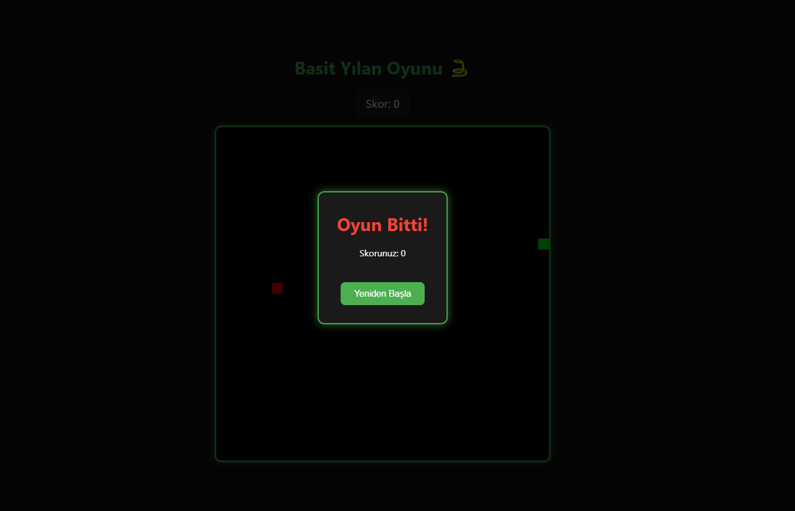

# 🐍 Basic Snake Game

Basit ama eğlenceli bir **Yılan Oyunu (Snake Game)** – TypeScript, HTML Canvas ve Vite kullanılarak geliştirilmiştir. Oyun; klasik yılan mekaniklerini modern JS mimarisiyle uygulamak isteyen geliştiriciler için sade bir örnek sunar.



## 🚀 Özellikler

- TypeScript ile yazılmıştır
- Canvas API kullanır
- WASD ve ok tuşları ile oynanabilir
- Puan sistemi ve skor göstergesi
- Oyun sonunda modal ile tekrar başlatma seçeneği

## 🎮 Oynanış

- **Yılanı yönlendirmek için:** `W`, `A`, `S`, `D` veya ok tuşlarını kullan.
- **Amaç:** Kırmızı kutularla temsil edilen yemleri yiyerek skoru artırmak.
- **Kurallar:** Duvara veya kendine çarptığında oyun biter.

## 🛠️ Kurulum

Projeyi klonla:
```bash
git clone https://github.com/aydinguzhan/Basic-snake.git
cd Basic-snake

npm install
npm run dev
